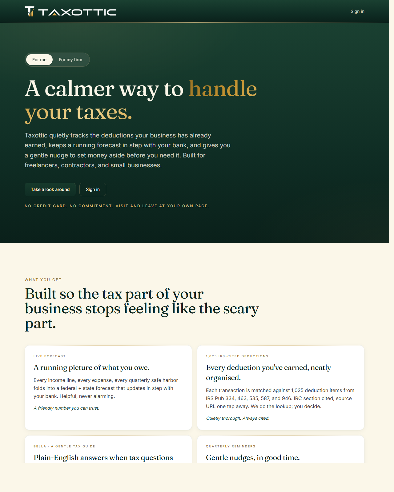
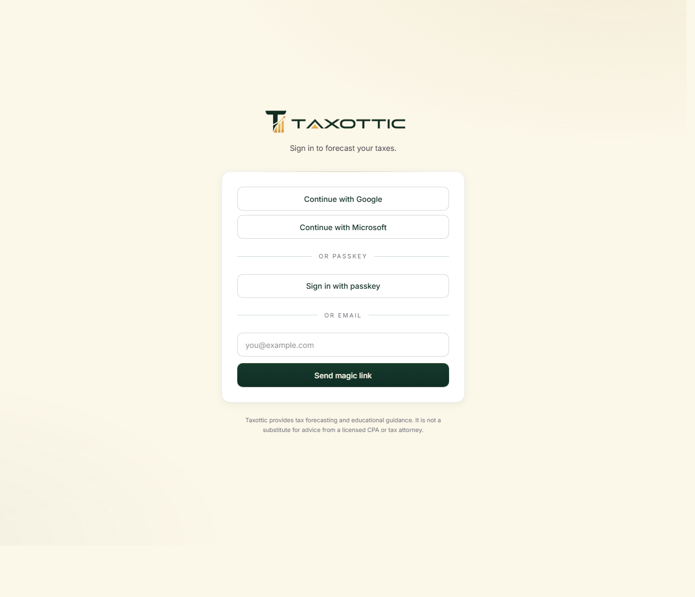
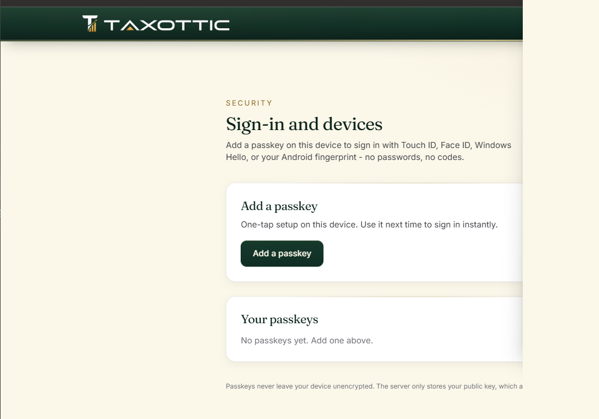
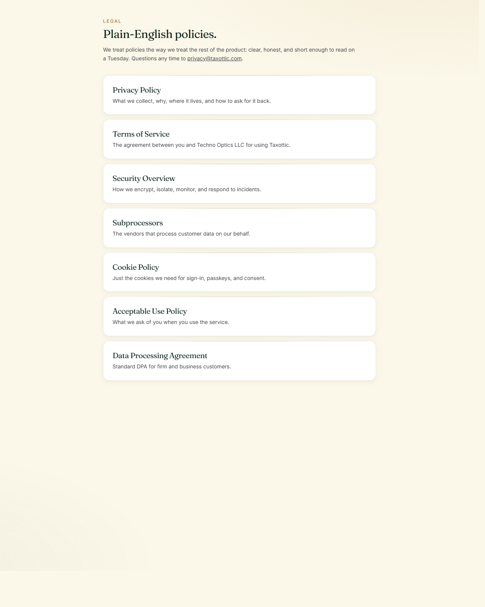

# Taxottic — User and Company Manual

**Operator's reference for the Taxottic platform**

Prepared by: Techno Optics LLC
Effective: 2026-05-05
Audience: end-users, accounting/tax-prep firm staff, and Techno Optics operators
Contact: contact@taxottic.com



---

## How to read this manual

The platform has two distinct user types and two distinct operating environments. Section I covers the **user side** — what a self-serve consumer or a firm's client experiences when they sign in to `taxottic.com`. Section II covers the **company side** — what the firm's internal staff and the Techno Optics team see at `hq.taxottic.com` and in the operations runbook.

A short third section describes the architecture and feature decisions that distinguish Taxottic from competing tools.

---

# Part I — The user side

This is the surface every consumer or firm-client interacts with. It is the same product whether the user signed up directly or was invited by their accountant; the only difference is the firm's branding when they signed up via a firm.

## 1. Signing in

Taxottic offers three sign-in paths, in this order of strength:

1. **Passkey (WebAuthn).** The strongest option. The user's device (Touch ID, Face ID, Windows Hello, an Android biometric, or a hardware security key) holds the private key and never lets it leave the device. There is no password to phish.
2. **Federated SSO with Google or Microsoft.** Familiar one-click flow. Multi-factor authentication is enforced by the identity provider; if the user has MFA on their Google or Microsoft account, that protection extends to Taxottic.
3. **Magic link by email.** Used as a low-friction fallback. Taxottic sends a one-time link to the user's verified email address; clicking it signs them in. Magic-link sessions cannot perform high-risk actions (subscription changes, full historical exports) without a re-authentication via passkey or SSO.



Taxottic does not store passwords. There is no password reset flow because there is no password to lose.

### What a new user does on first sign-in

The first time someone signs in, the platform walks them through a three-screen onboarding:

1. **Tax profile** — filing status (single, married filing jointly, etc.), state of residence, dependents. Five fields, ~30 seconds.
2. **Create your first company** — name, optional logo, entity type (Sole Prop, Single-Member LLC, Multi-Member LLC, S-Corp, C-Corp, Partnership, Self-Employed 1099, Nonprofit, Cooperative). The forecast and the deduction explorer immediately start tailoring themselves to this entity type.
3. **Welcome tour** — a guided overlay points to the dashboard tiles in order: forecast, banks, deductions, exports.

Existing users skip onboarding and land on the dashboard directly.

## 2. The dashboard

The dashboard is the user's home page. It is built around six tiles, plus a personalised greeting and a dynamically-computed **Tax Readiness** bar.

| Tile | Purpose |
| --- | --- |
| Tax forecast | Year-to-date federal + state liability with quarterly safe-harbor estimates |
| Banks | Plaid-connected institutions; one click to add another |
| Deductions | The 1,025-item IRS master list, filtered to the entity type |
| Schedule C export | One-click export of the YTD Schedule C in CSV + JSON |
| Goals | Plain-English targets the user can set and dismiss |
| Reminders | Quarterly-tax dates, document chase-ups, custom user nudges |

The **greeting** changes with the day of week, the time of year (April vs. mid-summer), and the company's stage (no transactions yet vs. quarter-end approaching). The **readiness bar** is a single-glance score combining: bank-feed health, deduction coverage relative to entity-type baseline, quarterly-estimate posture, and document completeness.

A user with multiple companies sees a tile per company across the top, switches with a click, and the rest of the dashboard repaints to reflect that company.

## 3. Per-company workspace

When the user enters a company (the URL becomes `/c/<publicId>/...`) the layout switches to a sidebar with the following sections.

### 3.1 Forecast

Federal + state liability projection for the current tax year, refreshed on every transaction change. Above-the-line deductions, simplified home-office calculation, and standard mileage are computed automatically when the inputs are present. The forecast surfaces under-withholding before April rather than after. Quarterly safe-harbor estimates are calculated alongside the headline number so the user can see whether their next quarterly payment is too low.

### 3.2 Income

Monthly income entries — salary, 1099s, freelance, K-1 distributions, dividends, interest — are listed by month and source. Recurrence rules let a user set "$5,000/month from Acme Corp" once and stop touching it; expansion is automatic. Bank feeds populate this view too, mapped from inbound bank transactions through the categorise-income engine.

### 3.3 Expenses

Same layout as Income, but for outflows. Expenses that the categoriser confidently maps to a Schedule C category are auto-applied; ambiguous ones land in the **Review queue** for the user to keep, recategorise, or dismiss. Once a transaction is applied, it lives in `monthly_expenses` and counts toward the forecast.

### 3.4 Banks

The page where the user adds and manages bank connections.

- **Connect a bank.** Opens Plaid Link, asks the user to choose their institution, and signs them in via Plaid's secure interface. Bank credentials never reach Taxottic servers.
- **What we see.** Institution name, last-four mask, balances, and the per-transaction merchant + amount + date.
- **Disconnect.** One click revokes the access token on Plaid's side and stops syncing. Existing transactions remain in the user's history; future ones do not arrive.

### 3.5 Deductions explorer

The standout view of the consumer product.

The IRS deduction master list — 1,025 line items derived from form 1040 plus Schedule C, Schedule A, Schedule E, and the major depreciation forms — is loaded into a single explorer. The explorer is filtered to the company's entity type so a Sole Prop sees only the deductions that apply to a Sole Prop. Each row tells the user:

- The plain-English description ("Office supplies", "Vehicle expenses, actual costs", "Health insurance premiums").
- The form and line where it lands ("Schedule C, Line 22", "Form 8829").
- The eligibility rules, in plain English.
- Any per-transaction matches the bank feed has already attached.

When the bank feed posts an expense that matches a deduction, the deduction's row picks it up automatically. The user can dismiss a match if it's wrong; the dismissal is remembered.

### 3.6 Schedule C export

One click generates a year-to-date Schedule C in two formats: a CSV that drops directly into TurboTax / Lacerte / Drake, and a JSON file that an accountant's API integration can consume. The export honours the company's entity type, so an S-Corp sees Form 1120-S line items and an LLC taxed as a partnership sees Form 1065 line items.

### 3.7 Sales tax

For companies that collect sales tax, this view tracks the state-by-state rate table, computes the obligation for the period, and surfaces upcoming filing deadlines. State rates are kept current from the Sales Tax Rate Master.

### 3.8 Profile, Manage, Preparer access

- **Profile.** Per-company information beyond the entity type: industry, operating address, fiscal year (if non-calendar), business EIN.
- **Manage.** Members of the company (employees, co-owners). Manager-only permissions like deleting the company or transferring ownership live here.
- **Preparer access.** Generates an invite for a tax professional to read the company's data without taking ownership. The professional can review and export but not edit. Useful for end-of-year handoff.

### 3.9 Chat

In-company messaging between the company's members. Each company has its own thread; conversations are scoped to the company's RLS so a member of Company A cannot read Company B's chat. Useful when the owner and an employee disagree on whether a transaction is a business expense.

## 4. Bella, the in-app guide

Bella is the conversational layer over the entire dataset. The user can ask in plain English:

- *"What's my home-office deduction this year?"*
- *"How much should I send for Q3?"*
- *"Did the Verizon charge last week count as a business expense?"*

Bella has read access to the user's own data via row-level security and answers using the same numbers the dashboard shows. She does not have write access — every action she suggests still requires the user to click. Conversations are retained for 12 months, then deleted automatically per the Data Retention and Disposal Policy.

Replies are generated by Anthropic on the user's behalf for the session and are not retained by Anthropic for training, per Techno Optics' enterprise agreement.

## 5. Goals and reminders

- **Goals.** Plain-English targets the user can set: *"Hit $40K in deductions by 12/31"*, *"Send Q4 estimate by 1/15"*. The dashboard surfaces progress, and a goal that's met fires a small celebration medal animation.
- **Reminders.** Quarterly-tax dates are seeded automatically on first sign-in (Q1 = 4/15, Q2 = 6/15, Q3 = 9/15, Q4 = 1/15 of next year). The user can add custom reminders; an email goes out the day before.

## 6. Account and security

`Settings → Sign-in and devices` is where the user manages their authentication.



- **Add a passkey.** One tap on the device. Touch ID / Face ID / Windows Hello prompts; the device generates the keypair and registers the public half with Taxottic.
- **Your passkeys.** Lists every enrolled passkey by device type with the last-used timestamp. The user can revoke any passkey, which immediately stops it from being usable.

## 7. Billing

If the user is a self-serve customer (not invited by a firm), the billing page shows the current plan, next renewal date, and a portal link into Stripe to update payment method or download invoices. Firm-invited clients do not see a billing page; the firm pays.

## 8. The legal pages

Every customer-relevant policy is published at `taxottic.com/legal/`:

- Privacy Policy
- Terms of Service
- Security Overview
- Subprocessors list (with data residency)
- Cookie Policy
- Acceptable Use Policy
- Data Processing Agreement (for firms and businesses)



The pages are written in plain English. When a user emails `privacy@taxottic.com` to exercise a GDPR or CCPA right, the request is acknowledged within 2 business days and resolved within 30 days. Deletion propagates to encrypted backups within the 30-day backup-retention window (so within 90 days end-to-end).

---

# Part II — The company side

This is the surface that Techno Optics operators and partner-firm staff see. It runs on `hq.taxottic.com` and on the operator's local environment. Customer data never moves between the two domains; the split is enforced at the middleware layer.

## 1. The HQ admin console

`hq.taxottic.com` is the operator console. Internally, every URL on `hq.taxottic.com` rewrites onto the `/admin/*` route tree, so the admin code lives at `/admin/firms`, `/admin/feedback`, `/admin/user/[id]`, but a staff member only ever types `hq.taxottic.com/firms`.

The HQ console is gated by `requireSuperAdmin` at the page level. No customer can reach it; even a logged-in customer who guesses the URL is bounced.

### What HQ shows

- **Firms.** Every firm tenant on the platform, with members, engagements, subscription status, and lifetime spend.
- **Users.** A user-detail view per email, with companies, sign-in audit trail, and a "suspend" button.
- **Feedback.** The inbox for the in-app feedback form. Read-only triage queue.
- **Audit logs.** Every super-admin action is logged.

## 2. Firm structure

A "firm" is the multi-tenant unit for accounting and tax-prep partners. The data model:

```
firms
 ├── firm_members           (staff)
 ├── firm_subscriptions     (Stripe metadata, tier)
 ├── firm_client_outreach   (lead intake from /book?for=firm)
 └── firm_inquiries         (questionnaires the firm asks of clients)
```

Each engagement (the firm's relationship with a single client) is a **company** in the data model — the same row type a self-serve user creates. The difference is ownership: a firm-managed company has a `firm_id` set and inherits the firm's RLS policies (any firm member can read it; only a firm admin can delete it).

### How a firm comes onboard

1. **Lead.** The firm fills out the public booking form at `taxottic.com/firms/order` (which redirects to `/book?for=firm`). The submission lands in `capture_attempts` and triggers a Slack/email notification to the Techno Optics team.
2. **Kickoff.** A Techno Optics operator logs in to HQ, clicks **New firm**, and provisions the tenant: subdomain, white-label assets, default tier.
3. **Staff invites.** The firm admin invites their staff via email; each invite carries a token that, when clicked, attaches the new user to the firm with the role the admin assigned (`admin` or `member`).
4. **Bulk client import.** The firm admin uploads a CSV of clients (name, email, entity type). Each row creates a `firm_inquiries` record with a magic-link invite. Clients sign in for the first time, complete their tax profile, and connect their bank.
5. **Firm goes live.** The firm admin sees a single dashboard listing every client, sortable by tax-readiness score, last-synced-at, or filing deadline.

## 3. The branded client portal

Firms on the Professional or Enterprise tier get a white-label portal:

- The login page shows the firm's logo instead of TAXOTTIC.
- The header shows the firm's name; the URL is `clients.<firm>.com` (CNAME to Vercel).
- Bella's introduction line names the firm.
- Outbound emails use the firm's sender domain.

The underlying platform is the same; only the chrome differs.

## 4. Compliance Center

Every tenant has its own compliance section under `Settings → Compliance`. It lists:

- Plaid attestation status (the four required items all currently show "Attested / Up to date").
- The most recent monthly audit reports (vulnerability scan, access-control review, zero-trust attestation, secure-tokens review, TLS/security headers, dependency freshness).
- The full set of policies (Information Security, Data Retention and Disposal, Vulnerability Management, Access Control), each linked to the latest branded PDF.

The compliance reports are auto-regenerated on the 28th of every month by the Windows Task Scheduler entry **"Taxottic Monthly Compliance Audits"**, which runs `npm run audits:monthly`. Output goes to OneDrive at `Documents for Plaid/Compliance/<YYYY>/<MM>/` and is uploaded into the tenant's compliance section automatically.

## 5. Banking architecture (operator's view)

For operators tracking cost, the bank-sync stack works like this:

| Trigger | What it does | Cadence |
| --- | --- | --- |
| **User connects a bank** | Plaid Link → access-token exchange → initial sync. Initial pull is bounded to year-to-date via `transactions.days_requested`. | Once, on connect |
| **Plaid webhook** (`TRANSACTIONS:SYNC_UPDATES_AVAILABLE`) | Verified by JWT, hits `syncPlaidConnection` with `force: false` | Whatever Plaid pushes |
| **Daily cron** at 04:00 UTC | Walks every active connection, hits `syncPlaidConnection` with `force: false` | Daily |
| **User clicks "Sync now"** | Hits `syncPlaidConnection` with `force: true` | On demand |

The throttle inside `syncPlaidConnection` short-circuits if the connection's `last_synced_at` is within the current calendar month. The result: at most one Plaid TRANSACTIONS:SYNC call per connection per month, regardless of how many webhooks fire or how many cron ticks pass. Failed runs do not update `last_synced_at`, so a Plaid outage on the 1st is automatically retried on the 2nd.

## 6. Token and certificate management

- **Plaid access tokens.** Encrypted at rest with AES-256-GCM. The encryption key lives in `BANK_TOKEN_ENC_KEY` in Vercel's encrypted env vars; it is never written to disk on application servers. Decryption happens just-in-time inside specific backend routes that need to call Plaid.
- **Plaid webhook signatures.** Every webhook is verified against Plaid's published JWKS via `lib/plaid/webhookVerify.ts`. JWTs older than 5 minutes are rejected.
- **TLS certificates.** Issued and renewed automatically by Let's Encrypt via Vercel for `taxottic.com`, `hq.taxottic.com`, and any white-label firm subdomains.
- **Service-role JWT (Supabase).** Held in Vercel env vars, only loaded inside server-side modules, never sent to the browser.

## 7. Row-level security model

The database is default-deny. Every multi-tenant table has `enable row level security` set, plus explicit policies that key on either `auth.uid()` or a firm-membership helper. Examples:

- `bank_connections`, `bank_accounts`, `account_transactions` — RLS limits each row to its owning user; firm staff see rows that belong to engagements they are a member of.
- `bank_connection_secrets` — RLS enabled with **no policies**, restricting the access-token vault to the service role only. The application backend decrypts tokens just-in-time inside a narrow set of routes.
- `firm_*` tables — RLS keys on the `is_firm_member()` helper plus an admin-role check.

A migration that adds a multi-tenant table without RLS is a defect and is caught by the **02-access-control-review** monthly audit.

## 8. Monthly compliance audits

Six scans run on the 28th of every month:

1. **Vulnerability scan** — `npm audit` + `npm outdated`, severity table, SLA references.
2. **Access control review** — counts RLS-enabled tables, confirms `lib/auth.ts` exports the guards, flags any `app/api/**/route.ts` that lacks a guard reference.
3. **Zero-trust attestation** — eight-control checklist (passkey routes present, SSO routes present, RLS coverage, service-role key not in client code, AES-GCM helper present, webhook verifier present, TLS enforced, no SSH surface).
4. **Secure tokens review** — confirms the encryption helper uses AES-256-GCM, the migration is in place, the webhook verifier uses Plaid's JWKS. Optional live TLS handshake against `taxottic.com`.
5. **TLS / security-headers scan** — fetches the live endpoints, checks HSTS, CSP, X-Content-Type-Options, Referrer-Policy, Permissions-Policy.
6. **Dependency freshness** — counts direct production dependencies, lists those with major versions behind, flags anything more than 12 months stale.

Output is two files per scan: a markdown report and the same content rendered to a branded PDF. Both land in `Compliance/<YYYY>/<MM>/`.

## 9. Pricing the firm tier

Firms are billed per active client engagement, monthly:

- **Essentials $50/year** — W-2 individuals, light Schedule C.
- **Professional $100/year** — sole props, single-member LLCs, light S-corps. Adds white-label, multi-Item Plaid, priority support.
- **Enterprise $150/year** — multi-entity, K-1, complex S-corps. Adds dedicated AM, API access, unlimited Items.

The full proposal ships as `Taxottic-for-Firms-Proposal_2026-05-04.pdf` in the OneDrive Proposals folder.

---

# Part III — What makes Taxottic stand out

## 1. The 1,025-item IRS master list

Most consumer tax tools surface a curated dozen deductions. Taxottic loads the full IRS master list — every deductible line item across the 1040 family — into a filterable explorer keyed to the company's entity type. A Sole Prop sees the Sole Prop universe. An S-Corp sees the S-Corp universe. The bank feed cross-references each transaction against the master list automatically, so the deductions a small business actually qualifies for surface without anyone having to know they exist.

## 2. Phishing-resistant MFA by default

The default sign-in path is a passkey, not a password. There is no password reset flow because there is no password to lose. Federated SSO inherits MFA from the identity provider; magic-link sessions are downgraded for high-risk operations. Firms that need stronger guarantees (hardware-backed FIDO2 keys for staff) get them with no extra integration work.

## 3. Cost-bound bank syncs

Plaid is the largest variable cost in the stack. Taxottic bounds it at the function level:

- The first sync after a connection is capped to year-to-date — the only window that matters for tax forecasting.
- Every subsequent sync is throttled to **at most once per calendar month per connection**.
- Webhooks acknowledge cheaply but do not trigger fresh API calls inside the throttle window.

The architecture lets us hold per-client list prices at $50–$150/year through 5,000 clients without a margin compression because Plaid usage is predictable, not reactive to user behaviour.

## 4. Default-deny database

Every multi-tenant table has Row Level Security enabled from the migration that creates it. Every authenticated query goes through Postgres RLS, not application-layer authorisation. The bank-token vault has RLS enabled with no policies — service-role-only by construction. A defect that exposes data via an unguarded API route is bounded by what RLS lets that user see, not by the route's logic.

## 5. Compliance is a feature, not a side project

The platform ships its own compliance pipeline:

- Six monthly audit scans, each producing a branded PDF.
- Four written policies (Information Security, Data Retention and Disposal, Vulnerability Management, Access Control), all branded with the same template.
- Plaid Production review passed on first submission. Every required attestation is closed out and renewed on schedule.
- A Windows Task Scheduler entry runs the audits on the 28th of every month, with automatic retry on the next day if a run fails.

A firm partner can ask for our security questionnaire response and receive it the same day, because the questionnaire response lives in the same monorepo as the code.

## 6. Branded PDFs across every artifact

A single shared script (`scripts/md-to-pdf.mjs`) renders every external-facing document — policies, proposals, monthly audit reports, this manual — through one branded template. The wordmark, the forest-green colour, the bottom-of-page footer ("Techno Optics LLC / <doc title> / Page X of Y") are identical across the document set. There is no off-brand artifact in the operator's workflow because the workflow only knows how to produce on-brand artifacts.

## 7. Plain-English everywhere

Policies are written in plain English. Bella's replies are written in plain English. Goal text is written in plain English. The dashboard greeting changes with the time of year. The ergonomic theme — that taxes are stressful enough already and the tool should not add to it — runs through both surface and substance.

---

## Appendix A — Quick reference

| What | Where |
| --- | --- |
| Public site | `taxottic.com` |
| User dashboard | `taxottic.com/dashboard` |
| Booking form for firms | `taxottic.com/firms/order` (redirects to `/book?for=firm`) |
| HQ console | `hq.taxottic.com` |
| Privacy policy | `taxottic.com/legal/privacy` |
| Security overview | `taxottic.com/legal/security` |
| Source of truth | `github.com/TechnoOptics/taxottic` |
| Compliance archive | OneDrive `Taxottic/Documents for Plaid/Compliance/` |
| Sales proposals | OneDrive `Taxottic/Proposals/` |

## Appendix B — Contacts

- **General inquiries:** `contact@taxottic.com`
- **Privacy / data requests:** `privacy@taxottic.com`
- **Security / disclosure:** `security@taxottic.com`
- **Sales / firm partnerships:** the booking form at `taxottic.com/firms/order`

---

*Techno Optics LLC, operating Taxottic. Document source lives at `docs/proposals/TAXOTTIC_USER_AND_COMPANY_MANUAL.md`; the PDF is regenerated through `scripts/md-to-pdf.mjs`.*
